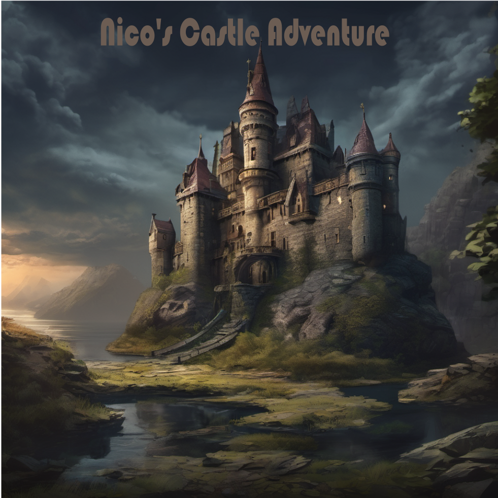

# Game Design Document: Nico's Kasteel Avontuur

## inleiding
Het doel van dit document is om een overzicht te bieden van het spelconcept, de gameplay, de personages en andere belangrijke aspecten van het spel Nico's Kasteel Avontuur.

## Concept
Nico's Kasteel Avontuur is een spel waarin je een jonge avonturier speelt die op zoek gaat naar het legendarische Nico Juweel in een oud, verlaten kasteel. Het spel gaat over verkennen, puzzels oplossen en het ontdekken van de geheimen van het kasteel.

## Gameplay
Het spel is een verkenning, puzzel en actiespel. De speler moet kamers van het kasteel verkennen, puzzels oplossen en vijanden verslaan om verder te komen in het verhaal. 
- De speler kan in het kasteel rondlopen en spelen met verschillende personages.
- De speler moet puzzels oplossen om vooruitgang te boeken, zoals het vinden van verborgen voorwerpen, het combineren van items en raadsels oplossen.
- Gevechten: De speler moet vijanden met zijn zwaard en vaardigheden verslaan.

## Personages
De jonge avonturier: Hij is vastbesloten het Nico Juweel te vinden.
De voormalige kasteelheer: Een mysterieus personage dat in de grote hal hangt en de speler helpt bij zijn zoektocht.
Andere personages: vijanden, bondgenoten en NPC's die de speler tegenkomt in het kasteel.

## Grafische stijl
Nico's Kasteel Avontuur heeft een gedetailleerde, sfeervolle grafische stijl met realistische omgevingen en personages die het mysterieuze en verlaten karakter van het kasteel benadrukken.
- Grote Hal: De grote hal kan donker en somber zijn met oude muren en een kapotte open haard. Het schilderij van de voormalige kasteelheer kan oud en verweerd zijn, met barsten en scheuren die de eeuwen van het kasteel weerspiegelen.
- De bibliotheek: kan vol oude boeken en houten planken zitten. Het kan warm en gezellig zijn, met zachte verlichting en comfortabele leesstoelen.
- De wapenkamer: kan donker en dreigend zijn, met scherpe wapens en harnassen die in het donker staan. Het schild in het midden van de kamer kan mysterieus zijn, met vreemde symbolen erop.
- Tuinzaal: De tuinzaal kan helder en kleurrijk zijn, met zonlicht en planten. De lichte, mysterieuze geur van de planten kan de kamer vullen, waardoor het een betoverende sfeer krijgt.
- De observatoriumkamer: is hoog boven het kasteel en heeft grote ramen die uitkijken over het landschap. De telescopen en astronoominstrumenten kunnen oud en nieuw zijn, met een gevoel van ontdekking en verwondering.

 

