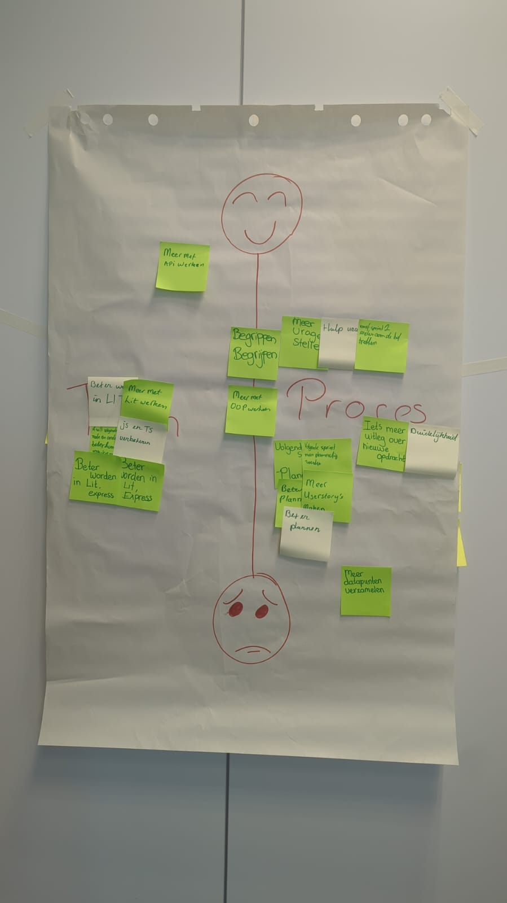

## Retrospective Sprint 0

Goedemiddag,

Zojuist hebben we onze retrospective gehad. Daarbij hebben we postIt op ons vel papier geplakt, waarbij hoe hoger de postIt hoe beter die was, dus hoe lager, hoe slechter die was. Onze punten waren, van meest gegeven naar laagst opgeschreven:

Bovenaan stond beter worden in LIT. Dit is best persoonlijk, dus dit gaan we per persoon in onze individuele retro uitleggen over hoe we dit gaan aanpakken.

Ook bovenaan stond meer plannen/beter plannen. We hebben hier zojuist even om gezeten, en de oplossing die we bedacht hebben is als volgt, we gaan dit weekend in een discord call met zijn vijven om de planning te maken. Dit gaan we aan de hand doen van weights, de weights die we hebben toegevoegd aan een user story's zijn in onze planning bepalend, qua wat is haalbaar in de komende drie weken. We wilden per se dit weekend de planning maken, aangezien we in de vakantie ook hard aan de slag gaan met de user story's om er na de vakantie zoveel mogelijk af te hebben. Deze planning is beter dan de planningen die we in vorige projecten gemaakt hebben, aangezien we nu allemaal voor de eerste keer met weights gaan werken. Dit zal naar waarschijnlijkheid heel goed gaan werken. 

Daarna kwam meer vragen stellen, ook dit is heel persoonlijk, dus degene die dit opgeschreven hebben gaan dit in hun persoonlijke retro uitleggen. 

Na vragen stellen kwam duidelijkheid over opdracht, ook dit is persoonlijk, we hadden zojuist namelijk even met Sybe besproken en dit valt eigenlijk ook onder vragen stellen. Dus stel er is geen duidelijkheid over een opdracht, dat we elkaar vragen durven stellen. Dit is ook persoonlijk dus ook dit valt onder de persoonlijke retro. 

Op de laatste plekken valt, meer datapunten verzamelen/begrippen begrijpen/ meer met OOP werken. Net zoals hiervoor vallen deze ook onder de persoonlijke retrospective. Dus degene die dit opgeschreven hebben zullen dit in hun persoonlijke retro toelichten. 

