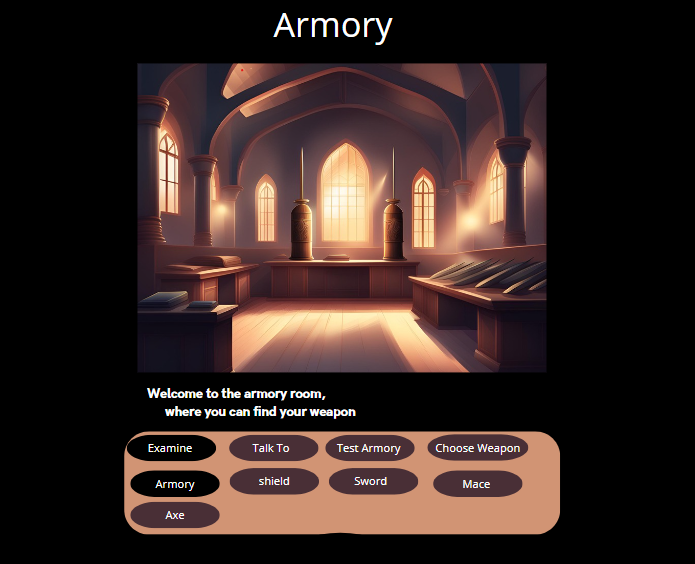
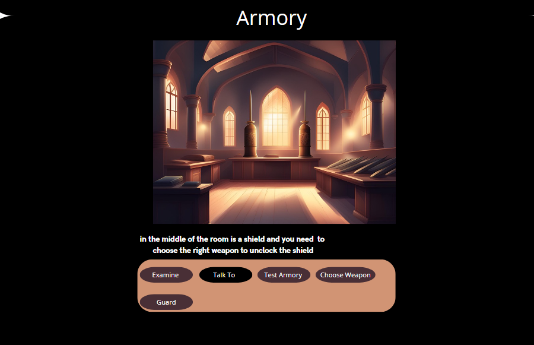
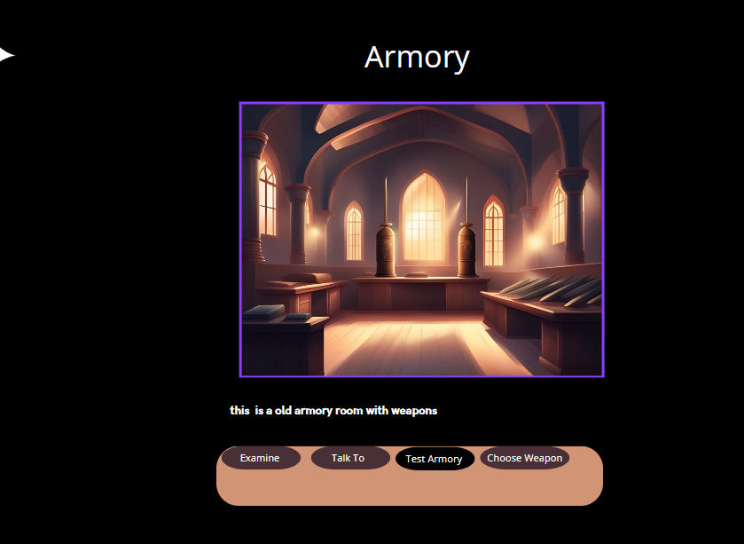

#
Introductie:
Je bent een jonge avonturier die op zoek is naar roem en rijkdom. Je hebt gehoord van een legendarische tunnel die naar een verborgen schat leidt, maar niemand heeft ooit de uitgang gevonden. Vastbesloten om de schat te vinden, waag je je in de Wapenkamer van een oud kasteel, waar je de eerste van vele uitdagingen zult tegenkomen.

Beschrijving van de Wapenkamer:
Bij het betreden van de Wapenkamer word je begroet door een imposant schild dat aan de muur hangt, omringd door verschillende symbolen van wapens. Een geheimzinnige stem klinkt door de kamer en vertelt je dat om de tunnel te vinden, je het juiste wapen moet kiezen dat past bij het schild.

Verhaallijn:

Je onderzoekt de Wapenkamer en ontdekt de symbolische knoppen achter elk wapensymbool.
Door aanwijzingen in de kamer te vinden en te interpreteren, realiseer je je dat het schild een symbool van bescherming en veiligheid vertegenwoordigt.
Je herinnert je een oude legende die spreekt over een beschermer die de tunnel bewaakt met zijn schild.
Met deze kennis kies je de knop achter het symbool van het schild en druk je erop.
Het sleutelgat naast het schild gaat open en onthult een geheime doorgang naar de tunnel.

Conclusie:
Je hebt de eerste hindernis overwonnen en bent een stap dichter bij het vinden van de verborgen schat. Maar er liggen nog meer uitdagingen op je pad terwijl je dieper de tunnel in gaat. Alleen met moed, slimheid en doorzettingsvermogen zul je de schat vinden en je naam in de geschiedenisboeken graveren als een legendarische avonturier.
de knop "Examine" klikken:

Zwaard: "Je onderzoekt het symbool van het zwaard en merkt op hoe de kling glinstert in het zwakke licht van de kamer. Het symbool straalt kracht en vastberadenheid uit, en je voelt een kille rilling langs je rug lopen."
Schild: "Als je het symbool van het schild onderzoekt, voel je een gevoel van veiligheid en bescherming over je heen komen. Het schild lijkt solide en ondoordringbaar, een bastion tegen elke dreiging die zich voordoet."
Helm: "Bij het onderzoeken van het symbool van de helm, voel je een gevoel van wijsheid en voorbereiding. De helm straalt autoriteit uit en herinnert je aan de noodzaak om je hoofd koel te houden te midden van de chaos van het avontuur."
Kruisboog: "Terwijl je het symbool van de kruisboog onderzoekt, voel je een gevoel van precisie en doelgerichtheid. De kruisboog lijkt klaar om elk doelwit te raken, een herinnering aan de noodzaak om nauwkeurig te zijn in je acties."
Kroon: "Wanneer je het symbool van de kroon onderzoekt, voel je een gevoel van macht en heerschappij. De kroon straalt glorie uit en herinnert je eraan dat grootsheid binnen handbereik ligt voor diegenen die dapper genoeg zijn om het te grijpen."
Drakenhoofd: "Als je het symbool van het drakenhoofd onderzoekt, voel je een gevoel van avontuur en gevaar. Het drakenhoofd lijkt te grommen met dreiging en uitdaging, een herinnering aan de gevaren die je te wachten staan op je reis."

Zwaard: Wanneer de speler op het zwaardsymbool klikt, wordt een verhaal geactiveerd waarin ze een oude krijger ontmoeten die hen vertelt over de 
kunst van het zwaardvechten. Hij geeft de speler een uitdaging om zijn vaardigheden te testen door een reeks virtuele duels aan te gaan. Hoewel de speler indrukwekkende prestaties kan leveren, leidt dit niet tot het openen van de tunnel. De krijger feliciteert de speler en vertelt hen dat moed alleen niet genoeg is om de weg naar de schat te vinden.

Schild: Als de speler op het schildsymbool klikt, opent het sleutelgat naast het schild en verschijnt er een geheime doorgang in de vloer. De speler daalt af in de tunnel, maar wordt geconfronteerd met een reeks valstrikken en obstakels die ze moeten overwinnen voordat ze verder kunnen gaan. Dit zorgt voor een spannend avontuur, maar het leidt niet direct tot het vinden van de schat.

Helm: Wanneer de speler op het helmsymbool klikt, worden ze meegenomen naar een verhaal over een oude koning die hen wijze lessen geeft over leiderschap en strategie. De speler krijgt een reeks uitdagingen voorgeschoteld die hen dwingen na te denken over hun keuzes en acties. Hoewel ze waardevolle inzichten kunnen opdoen, leidt dit niet direct tot het openen van de tunnel.

Kruisboog: Als de speler op het kruisboogsymbool klikt, worden ze uitgedaagd om hun vaardigheden als boogschutter te tonen in een reeks doelwituitdagingen. Ze moeten nauwkeurigheid en precisie tonen om hun doelen te raken. Hoewel dit indrukwekkende prestaties kan opleveren, leidt het niet tot het vinden van de schat.

Kroon: Wanneer de speler op het kroonsymbool klikt, worden ze meegenomen naar een verhaal over een glorieuze koning die triomfen viert. De speler wordt uitgedaagd om te bewijzen dat ze waardig zijn om naast de koning te staan door een reeks koninklijke taken uit te voeren. Hoewel ze glorie kunnen ervaren, leidt dit niet direct tot het openen van de tunnel.

Drakenhoofd: Als de speler op het drakenhoofdsymbool klikt, worden ze geconfronteerd met een denkbeeldige draak die hen uitdaagt voor een episch gevecht. De speler moet hun moed en slimheid tonen om de draak te verslaan. Hoewel dit een spannende uitdaging kan zijn, leidt het niet direct tot het vinden van de schat.

# Prototype

 
 
 

## 1. Startscherm:
Titel: Welkom in de Armory Room
Beschrijving: Hier, zul je de wapens van je bestemming smeden. Selecteer een wapen dat past bij het schild in het midden van de kamer.

## 2. Interactieve elementen:
* Schild: Klikbaar object in het midden van de kamer

Beschrijving: Een schild met een specifiek embleem. Dit geeft een aanwijzing over welk wapen je moet kiezen.
Interactie: "Het juiste wapen is zowel licht als dodelijk."

* Wapens: Klikbare objecten in de kamer

Zwaard:

Beschrijving: Een oud en roestig zwaard dat nog steeds bruikbaar lijkt.
Interactie: "Je hebt het zwaard gekozen. Geef het aan de bewaker."

Dolk:

Beschrijving: Een dolk. Licht en scherp, perfect voor snelle aanvallen.
Interactie: "Je hebt de dolk gekozen. Het voelt dodelijk, maar is het de juiste keuze?"

Bijl:

Beschrijving: Een zware bijl, krachtig en destructief.
Interactie: "Je hebt de bijl gekozen. Probeer opnieuw."

Kruisboog:

Beschrijving: Een kruisboog, krachtig en nauwkeurig.
Interactie: "Je hebt de kruisboog gekozen. Probeer opnieuw."

3. Bewaker:
Beschrijving: Een streng uitziende bewaker staat op wacht in de wapenruimte.
Interactieopties:
"Vraag om meer details over het schild."
"Vraag om hints over de wapens."

4. Resultaten:
Correcte Wapenkeuze (Zwaard):

Actie: Het sleutelgat naast het luik gaat open.
Feedback: "Het zwaard is het juiste antwoord! Het sleutelgat opent en je krijgt toegang tot de tunnel."
Verkeerde Wapenkeuze:

Actie: Waarschuwingssignaal en verder zoeken.
Feedback: "Dit is niet het juiste wapen. Probeer opnieuw."

## Extra puzzel
* timer ?
* raadsel ?

# Behoefteonderzoek: AOCM-methode

## Inleiding
Voor dit behoeftenonderzoek naar de interactieve wapenkamer heb ik de AOCM-methode (Afwijkingenonderzoek en Corrigerende Maatregelen) gebruikt. Deze methode komt van een onderzoek bij het Nederlands Talen Instituut (NTI) in Leiden. Het gaat om het vinden van afwijkingen en het maken van oplossingen voor problemen bij de automatiseringsafdeling.

# Methode
1. Identificatie van afwijkingen: In de eerste fase van het onderzoek zijn afwijkingen gevonden op basis van de verwachtingen en voorkeuren van spelers over de wapenkamer. Dit gebeurde door interviews met spelers zoals Mary, Aaliyah en Megan om hun verwachtingen en voorkeuren te begrijpen.

2. Opstellen van taakgebieden: Gebaseerd op de gevonden afwijkingen zijn verschillende taakgebieden opgesteld die te maken hebben met de interactie in de wapenkamer. Deze taakgebieden komen voort uit de verwachtingen en voorkeuren van de spelers die tijdens de interviews zijn genoemd.

3. Reflectie op huidige situatie: De huidige situatie van de wapenkamer is bekeken door eerst een beschrijving en een schema van de situatie te maken. Problemen zijn gevonden en vergeleken met de gewenste interactieve ervaring.

# Behoeftenonderzoeksvragen

1. Zijn er aspecten van de armory room die niet aan je verwachtingen voldoen?
Mary: Ja, ik had meer verschillende soorten wapens verwacht.
Aaliyah: Nee, de meeste dingen waren zoals ik had verwacht.
Megan: Ja, ik vond het te donker, ik kon niet goed zien wat er was.

2. Zijn er functionaliteiten binnen de armory room die niet goed werken of problemen veroorzaken tijdens het gebruik?
Mary: Nee, ik had geen problemen met de functionaliteiten.
Aaliyah: Ja, het informatiepaneel werkte soms niet.
Megan: Soms wel, de deuren gingen niet altijd open wanneer ze zouden moeten.

3. Zijn er inconsistenties of tegenstrijdigheden in de armory room die de spelervaring verstoren?
Mary: Niet echt, alles leek wel goed te passen.
Aaliyah: Ja, de volgorde van de wapens leek niet logisch.
Megan: Ja, sommige puzzels leken niet in lijn met het verhaal.

4. Zijn er gebieden binnen de armory room waar je vaak vastloopt of waar je moeite hebt om te navigeren?
Mary: Ja, bij de ingang van de geheime kamer liep ik vaak vast.
Aaliyah: Nee, ik kon overal goed doorheen komen.
Megan: Ja, de trappen waren verwarrend en ik wist niet waar ik heen moest.

5. Zijn er functies of interacties die je zou verwachten, maar die ontbreken in de armory room?
Mary: Ja, ik miste een kaart van de kamer.
Aaliyah: Nee, alles wat ik verwachtte was er wel.
Megan: Ja, ik had verwacht dat er meer NPC's zouden zijn om mee te praten.

# Conclusie
De AOCM-methode heeft geholpen bij het systematisch identificeren van afwijkingen en het formuleren van corrigerende maatregelen om de gewenste interactieve ervaring in de armory room te realiseren.

[Bron: Kloos, M. (2004). Analyse en aanbevelingen ten behoeve van de automatiseringsafdeling, een onderzoek naar afwijkingen & corrigerende maatregelen, operationele procedures en ICT beveiliging. De Haagse Hogeschool]

## Vragen
Wat zijn jouw verwachtingen van een interactieve armory room?
1. Aaliyah: Dat er veel wapens zullen zijn die ik kan bekijken en dat ik iets met ze kan doen om door te komen.
2. Megan: dat ik wapens kan gebruiken
3.

Wat voor soort interacties zou je willen hebben met de wapens en het schild in de armory room?
1. Aaliyah: waarschijnlijk dat ik ze dus kan bekijken en dat ik dan informatie krijg en dat ik dan weet welke goed is als ik het oppak.
2. Megan: dat ik ze kan gebruiken
3. 

Hoe belangrijk is het voor jou dat de armory room een verhaallijn of thema heeft? Zo ja, welk soort verhaallijn zou jou het meest aanspreken?
1. Aaliyah: hartstikke belangrijk het zou mij veel meer in de game en kamer houden als ik bijvoorbeeld de geschiedenis wist van elk wapen
2. Megan:  niet super belangrijk, maar wel dat alle kamers een verhaal uiteindelijk zijn            
3.

Zou je graag puzzels of uitdagingen willen tegenkomen tijdens het verkennen van de armory room? Zo ja, wat voor soort puzzels zou je interessant vinden?
1. Aaliyah: ja natuurlijk ik zou het leuk vinden als bijvoorbeeld en wapen me zou aanvallen of als je het oppakt je gameover krijgt
2. Megan:  ja, dat maakt het spel spannender. raadsels, of dat je eerst een wapen pakt en gebruikt en dan is het de verkeerde en moet je opnieuw de juiste wapen zoeken                                                                                                                  
3.

Heb je nog andere suggesties of ideeën die de armory room leuker of boeiender zouden maken?
1. Aaliyah: ja dus zoals ik al zei het is heeel leuk als er historische teksten bij de wapens en objecten zitten en ook dat er game obver scenarios zijn. 
2. Megan: minder wapens
3.

## feedback (My Armory room test)

Aaliyah: tops: kleuren zijn heel consequint, veel keuze tops: talk to optie pas als je de guard hebt examined, instructies zodat ik weet wat ik doe
Megan: tips: minder wapens en minder beshrijving, want anders wilt niemand de game spelen 

